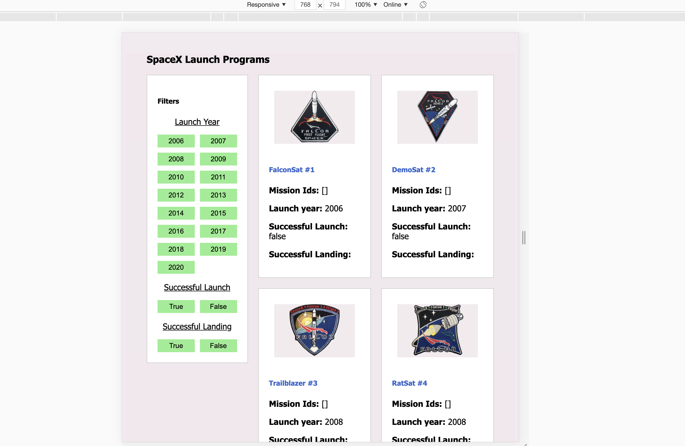

### Spacex Program in React using Server side Rendering

To run this project please do the below steps,

1. `npm install`

2. `npm run start` which will run the SSR. 

3. To run testcase `npm run test`.

`Demo Link:` https://mani-react-app-test.herokuapp.com/home

## Implemented the following cases in this application

- SSR rendering. 
- Semantic tags.
- Responsive design according to Mobile, Desktop, Tablet. 
- Jest setup and test case generation for one component.
- All the title cards are with same width. 
- Implemented based on the given design. 
- Implemented Filtering with toggle button option
- Generated the Lighthouse Report the hosted site.

#### Desktop View

#### Tablet View

#### Mobile View

